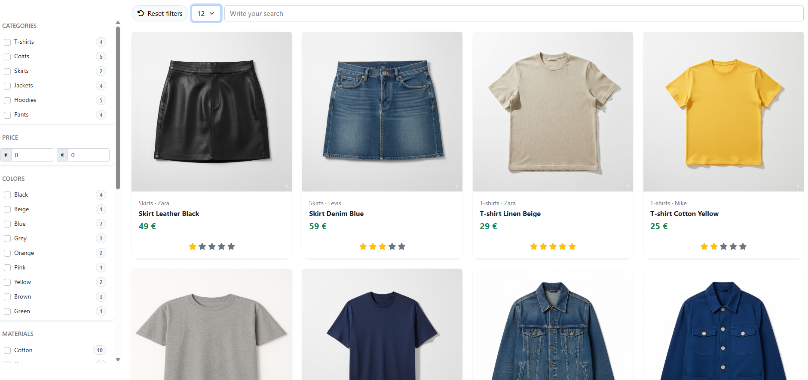

# Laravel Livewire Shop Filters  (Pipeline)


[🌐 Read in Spanish](README.es.md)

Este proyecto es un **ejemplo práctico** de cómo implementar un sistema avanzado de filtros en una tienda online utilizando **Laravel 12**, **Livewire 3** y el **Patrón Pipeline**.

Permite filtrar productos por categoría, marca, color, talla, material, precio, rating y búsqueda textual.

Cada filtro se implementa como una clase independiente y se integra de forma dinámica en un pipeline, lo que hace el sistema **extensible, limpio y desacoplado**.


## Requisitos previos

- **PHP ≥ 8.2**
- **Composer**
- **MySQL**


## Dependencias principales

- `laravel/framework` ^12.0  
- `livewire/livewire` ^3.6  
- `laravel/tinker` ^2.10  

## Instalación

1. Clonar el repositorio y colocarte en dentro:
 	```
    git clone https://github.com/LuisoJSM/laravel-livewire-filter-pipeline-ecommerce.git
    
   cd laravel-livewire-filter-pipeline-ecommerce
   ```
  
2. Instalar dependencias con Composer:
 	```
    composer install
   ```
 3. Crear el archivo de entorno .env a partir del ejemplo.
 	```
	cp .env.example .env   
	```
 4. Completa las variables de entorno dependiendo si estás en MySQL o con Sail.
 	```
	DB_CONNECTION=mysql
	DB_HOST=127.0.0.1
	DB_PORT=3306
	DB_DATABASE=nombre_de_tu_base
	DB_USERNAME=usuario
	DB_PASSWORD=contraseña
  
	```
   5. Generar la llave:
 	```
	php artisan key:generate   
	```
   6. Migrar tablas y seeders: 
 	```
	php artisan migrate:fresh --seed  
	```
   7. Levantar el servidor: 
 	```
	php artisan serve 
	```
   8. Acceder al localhost:
 	```
	http://localhost:8000 (O donde tengas el puerto)
	```
## Uso

### Funcionalidades principales

- **Filtros en la barra lateral**:  
  - Categoría  
  - Precio  
  - Color  
  - Material  
  - Talla  
  - Marca  
  - Valoración (rating)  
  - Búsqueda por texto  

-  **Actualización dinámica**: los productos se actualizan automáticamente al aplicar filtros, sin recargar la página, gracias a **Livewire 3**.

-  **Reset de filtros**: botón para limpiar todos los filtros y volver a la lista completa de productos.

-  **Paginación**: los resultados se muestran paginados con estilo Bootstrap.

	

---

##  Arquitectura de los filtros (Pipeline)

El sistema de filtros está construido siguiendo el **Patrón Pipeline** de Laravel. 

Cada filtro es una clase independiente que extiende de una clase abstracta común (`Filter`) y define cómo modificar la query de productos.

#### Flujo general

1.  El usuario interactúa con un componente **Livewire Filter** (ej. `CategoryFilter`, `PriceFilter`...).  
2.  El componente despacha un evento (`filters-updated`) hacia el **ProductsList**.  
3.  `ProductsList` guarda el estado del filtro en **sesión**.  
4.  Al renderizar productos, `ProductsList` envía la query base de `Product` a través de un **Pipeline**.  
5.  El Pipeline recorre los filtros activos y aplica sus condiciones (`where`, `whereIn`, `whereBetween`...).  
6.  Se devuelve la query final, lista para paginar y mostrar.

#### Esquema visual

```mermaid
flowchart TD
    A[Usuario selecciona un filtro] --> B[Componente Livewire Filter]
    B -->|dispatch event| C[ProductsList Component]
    C -->|guarda en sesión| D[Pipeline]
    D --> E{Filtros activos}
    E -->|Category| F[CategoryFilter]
    E -->|Price| G[PriceFilter]
    E -->|Color| H[ColorFilter]
    F & G & H --> I[Query de Product]
    I --> J[Resultados paginados]
```



### Ejemplo de filtro: CategoryFilter

Un filtro es simplemente una clase que hereda de `Filter` y define el método `handle()` donde modifica la query de productos.

```php
namespace App\Filters\Shop;

use App\Filters\Filter;
use Illuminate\Database\Eloquent\Builder;

final class CategoryFilter extends Filter
{
    public function handle(Builder $items, \Closure $next): Builder
    {
        // 1. Si no hay valor en el filtro, continuar sin modificar la query
        if (! $this->filter) {
            return $next($items);
        }

        // 2. Aplicar condición: solo productos de las categorías seleccionadas
        $items->whereIn('category_id', $this->filter);

        // 3. Pasar la query al siguiente filtro del pipeline
        return $next($items);
    }
}
```
En este caso:

- `$this->filter` contiene un array con los **IDs de las categorías seleccionadas**.  
- Se aplica `whereIn` sobre la columna `category_id`.  
- El pipeline continúa hacia el siguiente filtro (ej. **precio**, **color**...).  

---
### Filtros implementados


Actualmente el sistema soporta los siguientes filtros:

- **CategoryFilter** → Filtra productos por categoría.  
- **SearchFilter** → Busca productos por nombre.  
- **PriceFilter** → Filtra por rango de precios (mínimo / máximo).  
- **RatingFilter** → Filtra productos por valoración media.  
- **ColorFilter** → Filtra productos por color.  
- **SizeFilter** → Filtra productos por talla.  
- **BrandFilter** → Filtra productos por marca.  
- **MaterialFilter** → Filtra productos por material.  

Cada uno es una clase independiente y se integra de forma dinámica en el pipeline mediante el `enum ShopFilters`.

## Otros componentes clave de la arquitectura de filtros

Para mantener el sistema de filtros modular y extensible, el proyecto se apoya en:

- **Clase abstracta `Filter`**  
  Base de todos los filtros. Define la propiedad `$filter` (el valor recibido) y el método `handle()` que cada filtro concreto debe implementar.

- **Enum `ShopFilters`**  
  Enum que actúa como "fábrica de filtros".  
  Según el tipo de filtro (`category`, `price`, `color`...), devuelve la clase correspondiente (`CategoryFilter`, `PriceFilter`, etc.).

- **Traits de Livewire**  
  - `WithModelsFilter`: carga dinámicamente los modelos relacionados (ej. todas las marcas con el recuento de productos).  
  - `WithMultipleFilter`: gestiona filtros con selección múltiple (ej. varios colores, varias tallas).  
  - `WithSingleFilter`: gestiona filtros con un solo valor (ej. búsqueda por texto o un rango de precios).  

- **Componentes Livewire de filtros**  
  Cada filtro de la UI (ej. `BrandFilter`, `PriceFilter`, `SearchFilter`) extiende del componente base `Filter` y utiliza los traits necesarios. 
  
  Estos componentes se encargan de capturar la interacción del usuario y despachar el evento `filters-updated` hacia `ProductsList`.

- **`ProductsList`**  
  Es el componente que reúne todos los filtros. Recupera los valores desde sesión, aplica el Pipeline y renderiza los productos filtrados y paginados.

## Ejemplo de flujo completo

Supongamos que el usuario selecciona el color **"Azul"** en el filtro lateral:

1.  El usuario marca el checkbox "Azul" en el componente `ColorFilter` (Livewire). 

2.  `ColorFilter` actualiza la propiedad `$selectedModels` y despacha el evento `filters-updated`.  
3.  El componente `ProductsList` escucha el evento y guarda el valor en sesión bajo la clave `shop:color`.  
   - Ejemplo: `['color' => [3]]` donde `3` es el ID del color azul.  
4.  Cuando `ProductsList` se renderiza, llama a `getProducts()`.  

5.  `getProducts()` recupera los filtros activos de sesión y construye el pipeline:  
   - `ShopFilters::from('color')->create([3])` devuelve una instancia de `ColorFilter`.  
6.  El **Pipeline** ejecuta cada filtro activo en orden:  
   - `ColorFilter` aplica `whereIn('color_id', [3])` sobre la query de productos.  
   - Otros filtros (ej. precio, categoría, marca) se aplican en cascada si están activos.  
7.  El pipeline devuelve la query filtrada, que `ProductsList` pagina y envía a la vista.
 
8.  El usuario ve en pantalla únicamente los productos de color azul.  

## Contribución


Si quieres colaborar en el proyecto, sigue estos pasos:

1. Haz un **fork** del repositorio.  
2. Crea una rama nueva con tu feature o fix:  
   ```bash
   git checkout -b nueva-rama
3. Realiza tus cambios y haz commit:
    ```
    git commit -m "Añadir nueva feature"
 4. Haz push a tu rama:
    ```
    git push origin "Añadir nueva feature"
    
 5. Abre un Pull Request:
 
   ## Licencia
Este proyecto está bajo la licencia MIT

Eres libre de usarlo, modificarlo y distribuirlo respetando dicha licencia.
