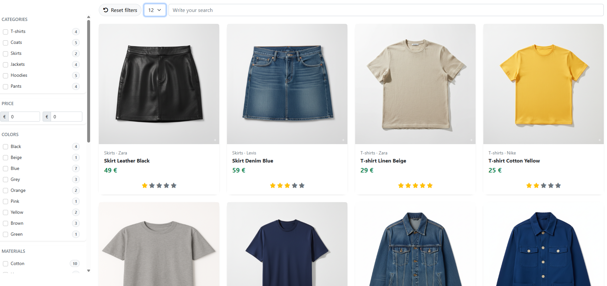
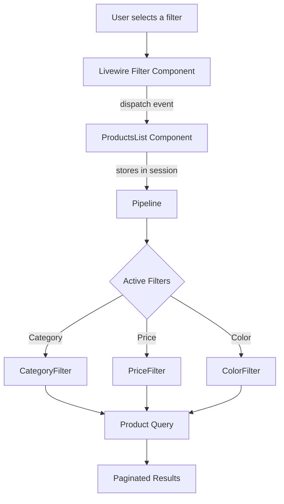

# Laravel Livewire Shop Filters (Pipeline)


This project is a **practical example** of how to implement an advanced filtering system in an online shop using **Laravel 12**, **Livewire 3**, and the **Pipeline Pattern**.

It allows filtering products by category, brand, color, size, material, price, rating, and text search.

Each filter is implemented as an independent class and integrated dynamically into a pipeline, making the system **extensible, clean, and decoupled**.

## Prerequisites

- **PHP ≥ 8.2**
- **Composer**
- **MySQL**


## Main Dependencies

- `laravel/framework` ^12.0  
- `livewire/livewire` ^3.6  
- `laravel/tinker` ^2.10  

## Installation

1. Clone the repository and navigate into it:
 	```
    git clone https://github.com/LuisoJSM/laravel-livewire-filter-pipeline-ecommerce.git
    
   cd laravel-livewire-filter-pipeline-ecommerce
   ```
  
2. Install dependencies with Composer:
 	```
    composer install
   ```
3. Create the `.env` file from the example:
 	```
	cp .env.example .env   
	```
4. Fill in the environment variables depending on whether you are using MySQL or Sail:
 	```
	DB_CONNECTION=mysql
	DB_HOST=127.0.0.1
	DB_PORT=3306
	DB_DATABASE=your_database_name
	DB_USERNAME=user_name
	DB_PASSWORD=password
  
	```
5. Generate the application key:
 	```
	php artisan key:generate   
	```
6. Run migrations and seeders:
 	```
	php artisan migrate:fresh --seed  
	```
7. Start the development server:
 	```
	php artisan serve 
	```
8. Access the application in your browser:
 	```
	http://localhost:8000 (or whichever port you have configured)
	```

## Usage

### Main Features

- **Sidebar Filters**:  
  - Category  
  - Price  
  - Color  
  - Material  
  - Size  
  - Brand  
  - Rating  
  - Text search  

- **Dynamic Update**: products are automatically refreshed when applying filters, without reloading the page, thanks to **Livewire 3**.

- **Reset Filters**: button to clear all filters and return to the full product list.

- **Pagination**: results are displayed with Bootstrap-styled pagination.

  

---

## Filter Architecture (Pipeline)

The filter system is built following Laravel’s **Pipeline Pattern**.

Each filter is an independent class that extends a common abstract class (`Filter`) and defines how to modify the product query.

#### General Flow

1. The user interacts with a **Livewire Filter** component (e.g., `CategoryFilter`, `PriceFilter`...).  
2. The component dispatches a (`filters-updated`) event to **ProductsList**.  
3. `ProductsList` stores the filter state in **session**.  
4. When rendering products, `ProductsList` sends the base `Product` query through a **Pipeline**.  
5. The Pipeline iterates over the active filters and applies their conditions (`where`, `whereIn`, `whereBetween`...).  
6. The final query is returned, ready to paginate and display.

#### Visual Diagram



### Filter Example: CategoryFilter

A filter is simply a class that extends `Filter` and defines the `handle()` method, where it modifies the product query.

```php
namespace App\Filters\Shop;

use App\Filters\Filter;
use Illuminate\Database\Eloquent\Builder;

final class CategoryFilter extends Filter
{
    public function handle(Builder $items, \Closure $next): Builder
    {
        // 1. If there is no filter value, continue without modifying the query
        if (! $this->filter) {
            return $next($items);
        }

        // 2. Apply condition: only products from the selected categories
        $items->whereIn('category_id', $this->filter);

        // 3. Pass the query to the next filter in the pipeline
        return $next($items);
    }
}

```

In this case:

- `$this->filter` contains an array with the **IDs of the selected categories**.  
- A `whereIn` is applied on the `category_id` column.  
- The pipeline continues to the next filter (e.g., **price**, **color**...).  

---

### Implemented Filters

The system currently supports the following filters:

- **CategoryFilter** → Filters products by category.  
- **SearchFilter** → Searches products by name.  
- **PriceFilter** → Filters by price range (minimum / maximum).  
- **RatingFilter** → Filters products by average rating.  
- **ColorFilter** → Filters products by color.  
- **SizeFilter** → Filters products by size.  
- **BrandFilter** → Filters products by brand.  
- **MaterialFilter** → Filters products by material.  

Each one is an independent class and is dynamically integrated into the pipeline via the `ShopFilters` enum.

---

## Other Key Components of the Filter Architecture

To keep the filter system modular and extensible, the project relies on:

- **Abstract Class `Filter`**  
  Base for all filters. Defines the `$filter` property (the received value) and the `handle()` method that each concrete filter must implement.

- **Enum `ShopFilters`**  
  Enum that acts as a "filter factory."  
  Depending on the filter type (`category`, `price`, `color`...), it returns the corresponding class (`CategoryFilter`, `PriceFilter`, etc.).

- **Livewire Traits**  
  - `WithModelsFilter`: dynamically loads related models (e.g., all brands with the product count).  
  - `WithMultipleFilter`: handles filters with multiple selections (e.g., several colors, multiple sizes).  
  - `WithSingleFilter`: handles filters with a single value (e.g., text search or a price range).  

- **Livewire Filter Components**  
  Each UI filter (e.g., `BrandFilter`, `PriceFilter`, `SearchFilter`) extends the base `Filter` component and uses the necessary traits.  

  These components capture user interaction and dispatch the `filters-updated` event to `ProductsList`.

- **`ProductsList`**  
  The component that gathers all filters. It retrieves values from the session, applies the Pipeline, and renders the filtered and paginated products.

## Full Flow Example

Suppose the user selects the color **"Blue"** in the sidebar filter:

1. The user checks the "Blue" checkbox in the `ColorFilter` component (Livewire).  

2. `ColorFilter` updates the `$selectedModels` property and dispatches the `filters-updated` event.  

3. The `ProductsList` component listens to the event and stores the value in the session under the key `shop:color`.  
   - Example: `['color' => [3]]` where `3` is the ID of the blue color.  

4. When `ProductsList` is rendered, it calls `getProducts()`.  

5. `getProducts()` retrieves the active filters from the session and builds the pipeline:  
   - `ShopFilters::from('color')->create([3])` returns an instance of `ColorFilter`.  

6. The **Pipeline** executes each active filter in order:  
   - `ColorFilter` applies `whereIn('color_id', [3])` to the product query.  
   - Other filters (e.g., price, category, brand) are applied in cascade if active.  

7. The pipeline returns the filtered query, which `ProductsList` paginates and sends to the view.  

8. The user sees only blue-colored products on screen.  

## Contributing

If you want to collaborate on the project, follow these steps:

1. Make a **fork** of the repository.  
2. Create a new branch with your feature or fix:  
   ```bash
    git checkout -b new-branch
3. Make your changes and commit:
    ```
    git commit -m "Add new feature"
 4.Push your branch:
    ```
    git push origin "Añadir nueva feature"
    
 5. Open a Pull Request.
 
## License
This project is under the MIT license.

You are free to use, modify, and distribute it under the terms of this license.
